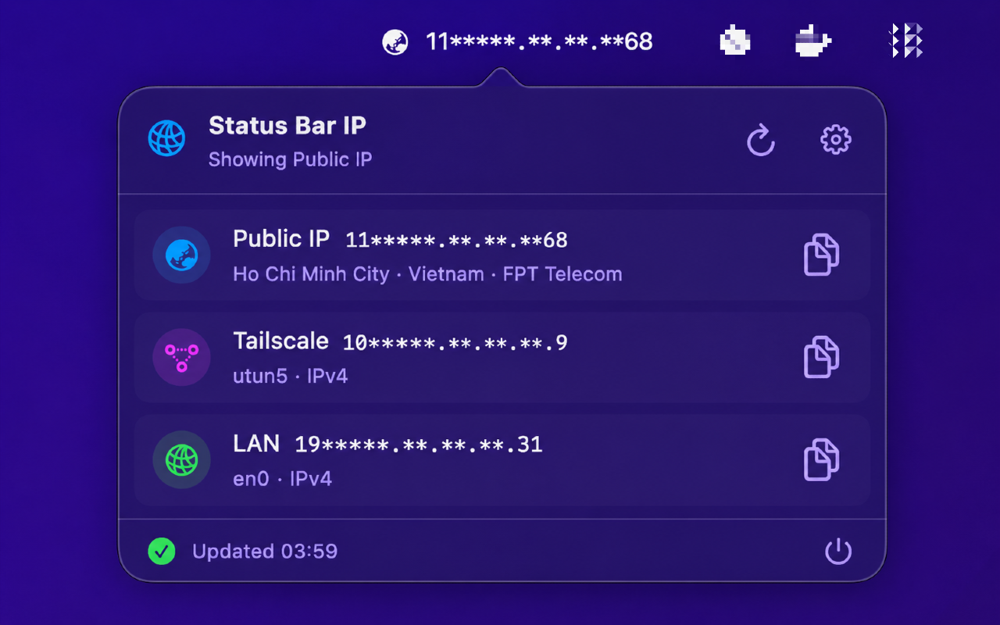
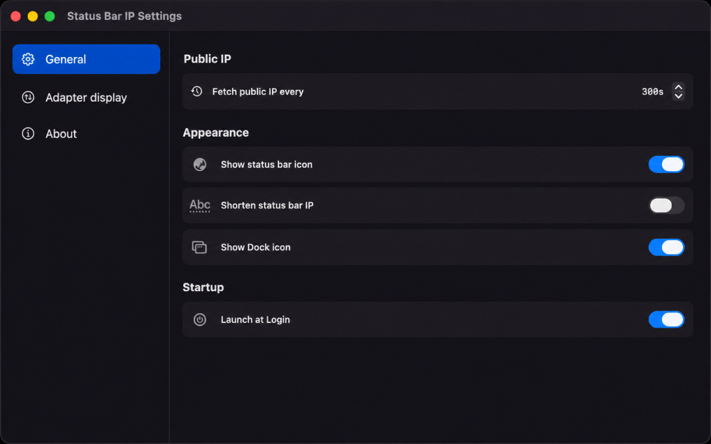
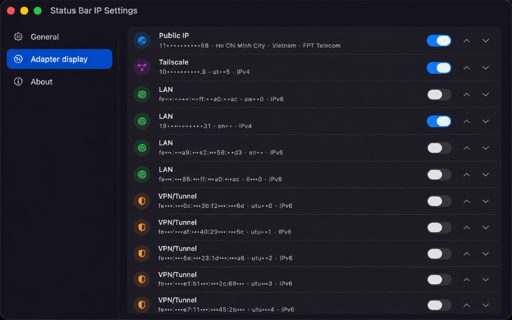
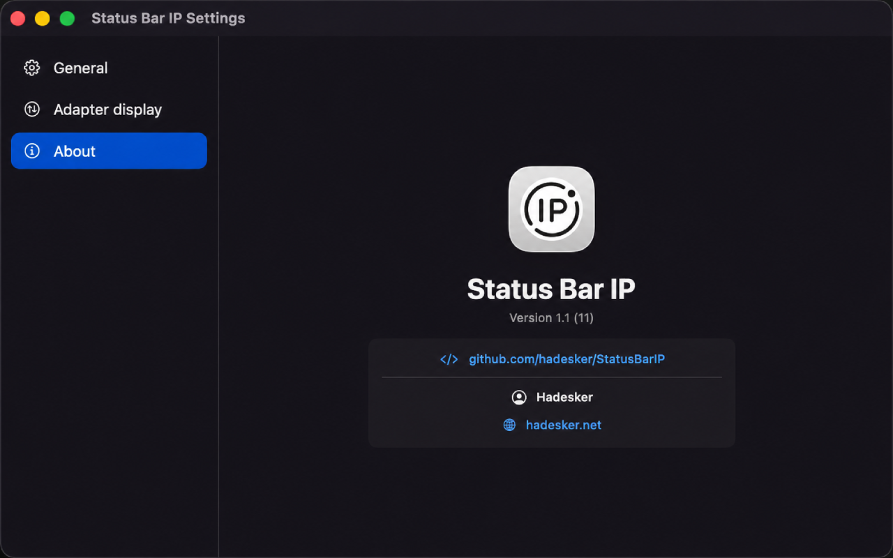

# Status Bar IP

Status Bar IP is a small macOS menu bar utility that displays the current public IP address and local adapter addresses. It is built with SwiftUI for the UI layer and AppKit for precise menu bar behavior.

## Screenshots

### Popover



### Settings: General



### Settings: Adapter Display



### Settings: About



## Features

- Shows the selected IP address in the macOS status bar.
- Optional status bar adapter icon.
- Fetches public IP data from `https://ip.faster.asia/?json=true`.
- Enumerates local network interfaces with `getifaddrs`.
- Classifies adapters as Public IP, Tailscale, LAN, VPN/Tunnel, or Other.
- Left click opens a SwiftUI popover with visible IP addresses.
- Clicking an IP copies it to the clipboard.
- Right click opens a native menu with Settings and Close.
- Settings window includes:
  - General settings for public IP refresh interval, Dock icon visibility, launch at login, and status bar icon visibility.
  - Adapter display settings for ordering and hiding adapters.
  - About page with app metadata and project links.

## Requirements

- macOS 14.0+
- Xcode 16+ or newer
- Swift 6 project settings

## Project Structure

```text
StatusBarIP/
  AppDelegate.swift              AppKit lifecycle, status item, popover, settings window
  StatusBarIPApp.swift           SwiftUI app entry point
  Info.plist                     Bundle metadata and LSUIElement config
  Models/
    IPModels.swift               IP models and adapter classification
  Services/
    AppSettings.swift            UserDefaults-backed settings
    IPStore.swift                Observable app state and refresh orchestration
    LocalIPService.swift         Local adapter enumeration via getifaddrs
    PublicIPService.swift        Public IP fetcher via URLSession
  Views/
    PopoverView.swift            Status item popover UI
    SettingsView.swift           Settings sidebar and panes
  Assets.xcassets/               App icon catalog

StatusBarIPTests/
  StatusBarIPTests.swift         JSON decoding, classification, ordering fallback tests
```

## Build

From the repository root:

```sh
xcodebuild \
  -project StatusBarIP.xcodeproj \
  -scheme StatusBarIP \
  -configuration Debug \
  -derivedDataPath ./DerivedData \
  build
```

The debug app bundle is created at:

```text
DerivedData/Build/Products/Debug/Status Bar IP.app
```

## Test

```sh
xcodebuild \
  -project StatusBarIP.xcodeproj \
  -scheme StatusBarIP \
  -configuration Debug \
  -derivedDataPath ./DerivedData \
  test
```

In sandboxed environments, `xcodebuild test` may fail when Xcode cannot communicate with `testmanagerd`. Run the command from a normal terminal or grant the required permission if your automation environment restricts that service.

## Architecture Notes

`IPStore` is the central observable state object. It owns current entries, public IP response metadata, settings, clipboard copy state, timer refresh, Dock visibility, and Launch at Login state.

`StatusItemController` uses `NSStatusItem` instead of SwiftUI `MenuBarExtra` so left click and right click can be handled differently:

- Left click toggles the SwiftUI `NSPopover`.
- Right click temporarily assigns an `NSMenu` with Settings and Close.

Public IP fetching is implemented with `URLSession`, not shelling out to `curl`. Local adapter enumeration is implemented with `getifaddrs`, with IPv4 prioritized by the service and IPv6 kept when available.

Settings are persisted with `UserDefaults` through `UserDefaultsSettingsStore`:

- `fetchInterval`
- `orderedIDs`
- `hiddenIDs`
- `showDockIcon`
- `showStatusBarIcon`

Launch at Login is managed through `SMAppService.mainApp`.

## Adapter Classification

Adapter classification lives in `AdapterClassifier`:

- Tailscale: interface name contains `tailscale`, is `tailscale0`, or IPv4 is in `100.64.0.0/10`.
- VPN/Tunnel: `utun`, `tun`, `tap`, `ppp`, or names containing `vpn`.
- LAN: private IPv4 ranges or link-local IPv6.
- Other: fallback for unclassified interfaces.

## App Metadata

- Bundle ID: `net.hadesker.statusbarip`
- Product name: `Status Bar IP`
- Minimum macOS version: `14.0`
- App category: Utilities
- Default mode: menu bar app via `LSUIElement`

## Development Tips

- Keep generated files out of git. `DerivedData/`, Xcode user data, `.xcresult`, and build outputs are ignored.
- If the Dock icon or app name looks stale, quit any old running copy and launch the app bundle from the latest `DerivedData` build.
- If adding new settings, update `AppSettings`, `UserDefaultsSettingsStore`, and tests that construct `AppSettings` directly.
- If adding new adapter kinds, update `AdapterKind.defaultOrder`, `AdapterKind.symbolName`, `AdapterKind.tint`, and classification tests.

## Links

- App Store: https://apps.apple.com/us/app/status-bar-ip/id6768105320
- GitHub: https://github.com/hadesker/StatusBarIP
- Author: Hadesker
- Website: https://hadesker.net
